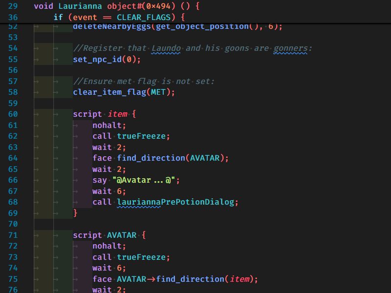

# Exult Usecode Syntax for VS Code

Syntax highlighting for Exult's UseCode C (UCC) and UseCode Assembly files.

This extension provides TextMate-based grammars for UseCode source files (extensions: .ucc, .uc, .uh, .ucxt) and UseCode assembly (.uca). It focuses on accurate highlighting of keywords, types, numbers, strings, comments, directives, script commands, intrinsics, and labels.

## Features

- TextMate grammar for UseCode C (UCC) with:
  - Keywords, types, operators
  - Strings and escape sequences
  - Line and block comments
  - Directives (#include, #game, #line, etc.)
  - Intrinsic and user function highlighting
- TextMate grammar for UseCode Assembly (.uca) with mnemonics, labels, directives and comments
- Language configuration (brackets, auto-closing, surrounding pairs)
- Sample file included at `samples/test.uc` for testing and verification

## Installation

Install from the Marketplace once published, or test locally:

1. Install dependencies (for packaging):

```bash
npm install -g vsce
```

1. Package locally:

```bash
vsce package
```

1. Install the produced `.vsix` in VS Code: open Command Palette -> "Extensions: Install from VSIX..."

Or run the extension in the Extension Development Host via the Debug view.

## Usage

- Open any UseCode source file (e.g. `*.uc`, `*.ucc`, `*.uh`, `*.ucxt`, `*.uca`). VS Code should auto-detect the language. If not, set the language mode at the bottom-right and choose "UseCode" or "Usecode Assembly".
- Use the included `samples/test.uc` as a quick verification of highlighting coverage.

## Screenshots

Include screenshots in `images/` and reference them here. Example:



_If no screenshot is present, the Marketplace will still display the README text; screenshots are recommended._

## Changelog

See `CHANGELOG.md` for release history.

## License

This project is licensed under GPL-2.0-or-later. See the `LICENSE` file for details.

## Contributing

Contributions are welcome. Please open an issue or pull request on the repository. When contributing:

- Add tests or examples where useful
- Keep grammar changes minimal and documented
- Include sample snippets or test cases for any new rules

## Contact and repository

Please add repository information in `package.json` (repository, bugs, homepage) so the Marketplace page links to the source. Replace placeholders with your repository URL before publishing.

---

If you'd like, I can: add a placeholder `images/icon.png` and `images/screenshot1.png`, wire up a simple GitHub Actions workflow to package on push, and finish the remaining package.json metadata. Tell me which you'd prefer next.
